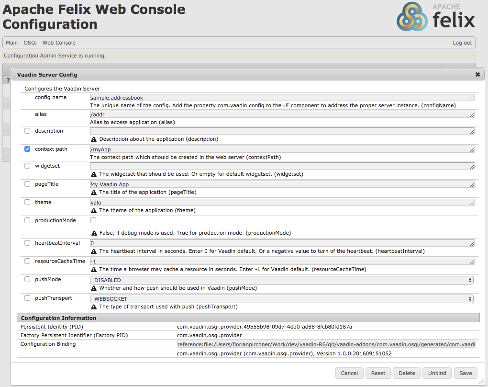

# 

These bundles offer a Vaadin OSGi R6 brige based on the OSGi prototype scope. It is heavily based on Configuration Manager. Configurations can easily be done using the Apache Felix web console or by a JSON File.

The main goal of this implementation is to provide a very simple way to create OSGi applications based on Vaadin. The AddressBookUi sample shows how easy it is to create a new application.

## Your own application

To create your own application, you need to define 2 things:

1.  UI-Class annotated properly
2.  A configuration used by ConfigAdmin

### UI-Class

	@Component(scope = ServiceScope.PROTOTYPE, service = UI.class, property = {
		OSGiConstants.PROP__VAADIN_UI_CLASS + "=com.vaadin.osgi.example.addressbook.AddressBookUi",
		OSGiConstants.PROP__VAADIN_CONFIG + "=sample.addressbook" })
	public class AddressBookUi extends UI {
		@Override
		protected void init(VaadinRequest request) {
			setContent(new Label("AddressBook"));
		}
	}
 Just define a Vaadin UI as explained in Vaadin documentation. Then you need to annotate the class with the `@Component` annotation.
 The `@Component` annotation tells the OSGi framework that there is an OSGi-Service (scope=prototype) available to create many instances of the 	 UI class.
 
 Additionally you need to add two properties to the service registration:
 
*   `Constants.PROP__VAADIN_UI_CLASS` - the value must be the fully qualified name of the UI class. The property is a workaround to inform the UiProvider about the UI class.
*   `Constants.PROP__VAADIN_CONFIG` - a unique ID which wires the UI class to the configuration from ConfigAdmin.

### Configuration
There are 3 ways available to create a proper configuration:

1.  Use the Apache felix webconsole
2.  Create a JSON file with configuration
3.  Use the API of the ConfigAdmin

#### Apache Felix web console
This is a pretty simple way to configure a Vaadin application. See <http://felix.apache.org/documentation/subprojects/apache-felix-web-console.html> for details on how to install the web console. 

When the Apache Felix web console is installed and you have implemented the UI class, then remember the value of the property `Constants.PROP__VAADIN_CONFIG` .
Start your OSGi application and point a browser to <http://localhost:8080/system/console/configMgr>. Use "admin" and "admin" for the credentials.

You find a row called "Vaadin Server Config". Press the "add" button. Then following form is shown. 

 

Put the value of `Constants.PROP__VAADIN_CONFIG` (eg. sample.addressbook) into the first field "config name" and specify an alias; eg. "/addr".
All other fields are optional. If you press the "save" button, your Vaadin application will startup.

Point your browser to <http://localhost:8080/addr> and your Vaadin UI shows up. If you specified a context path, you also need to add the context path to your URL, e.g. <http://localhost:8080/myapp/addr>.

#### JSON file
The Vaadin Addon uses the enRoute simple configurer: 
<https://github.com/osgi/osgi.enroute.bundles/tree/master/osgi.enroute.configurer.simple.provider>  

This bundle is aware about JSON files located in the folder /configuration. You need to specify the the values from the configuration (same as in webconsole) in the JSON file.

On startup of the server, the enRoute simple configurer finds the configuration and will do all required calls to the ConfigAdmin for you.

Create a file /configuration/configuration.json in any bundle. And put in the following content (Note that the `service.pid` is unique. Every configuration requires their unique pid. The `service.factoryPid` is a constant):

	[
		{
			"description":				"Config for Addressbook Sample",
			"service.pid":				"com.vaadin.osgi.sample.addressbook",
			"service.factoryPid":		"com.vaadin.osgi.provider",
			"configName":				"sample.addressbook",
			"alias":					"/addr",
			"contextPath":				"/myApp"
		}
	]

#### API of ConfigAdmin
If you want to have control about the Vaadin instances in your code, just use the API of the ConfigAdmin (see OSGi compendium specification for details).

## Setup Workspace in Eclipse
This project uses BndTools for development.

Setup your Eclipse IDE:
1. Install Eclipse Neon for RCP- and RAP-Developer <http://www.eclipse.org/downloads/>
2. Inside eclipse "Help -> Marketplace" and install BndTools
3. Clone the repository
4. Import the cnf and com.vaadin.osgi project into the workspace

After these steps you should have a clean workspace without any errors. 

## Debug addressbook example
To debug the application... 

1. Open the `servlet.debug.bndrun`
2. Press "resolve" -> everything should be fine
3. Press the debug icon

The configuration is done by  `sample-resources/addressbook/configuration.json`. You may change it using the WebConsole.

Point your browser to <http://localhost:8080/myApp/addr>.

## References

The sourcecode for this addon is available under: <https://github.com/vaadin-osgi/vaadin-addons/tree/master/com.vaadin.osgi>

Apache Felix web console: <http://felix.apache.org/documentation/subprojects/apache-felix-web-console.html>

OSGi core and compendium spec: <https://www.osgi.org/developer/downloads/release-6/release-6-download/>

